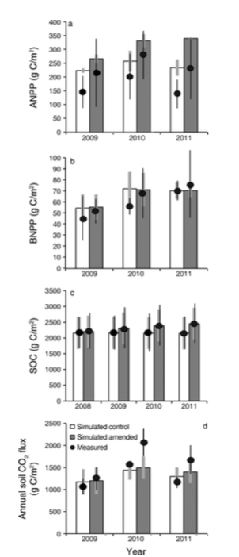

### **Grassland compost amendments increase plant production without changing plant communities**

https://esajournals.onlinelibrary.wiley.com/doi/full/10.1002/ecs2.1270

_R Ryals, VT Eviner, C Stein, KN Suding, WL Silver - Ecosphere, 2016 - Wiley Online Library_

Is this a lab assay, or something they do in the field? What's the spatial distribution of the sample across the field? Regular? Random? How many samples? Are the samples homogenized somehow?
- __field experiment__, "Treatments consisted of untreated controls and one‐time additions of composted organic matter. Plots were 25 × 60 m buffered by a ≥5‐m strip arranged in __three randomized complete blocks at each site__"
- My guess is that their was an assumption that the sites were already homogenized,as nothing is said about having samples homogenized. That said, a different paper on this same field study considered the valley grassland to be 'one site characterization', with 'no significant differences in ecosystem characteristics and management responses between blocks at this site' whereas __the coastal grassland was represented by two characterizations__ 'to capture a significant difference in soil texture of one of the replicate blocks.' 

Are there repeated samples or analyses of samples taken in the same place, to calibrate the reproducibility of the measurement? 

- Measurements were taken __each year throughout the 4 year project.__

How does the measuring instrument work? What's its accuracy? How accurately can we determine the total mass of N? What's behind the calculation of the amount of N? Do you believe the error bars?

Measuring vegetation:

- _"Vegetation surveys were conducted using both point intercept and cover class methods"_
  - point intercept: "a pin was placed every 0.5 m along each transect. All individuals touching the pin were identified to the species level. Each individual was only recorded once per pin. Relative cover of each species was calculated as the number of times a species was recorded divided by the number of points. Species richness was determined as the number of unique species identified from all pin points."
  - "Cover classes were determined according to the Daubenmire subplot method (Daubenmire 1959). A 1 × 1 m quadrat was placed at every 8 m along each transect, for a total of 10 Daubenmire subplots per treatment plot. Within each Daubenmire subplot, percent cover per square meter was visually estimated into one of seven categories: 0%, <1%, 1–5%, 5–25%, 26–50%, 51–75%, 76–100%. Relative percent cover was averaged across subplots using the midpoint value for each category. Cover estimates were then used to calculate evenness values for each treatment plot based on the Shannon Index (McCune and Grace 2002). Species richness was determined as the number of unique species per 1 m2 averaged across subplots for each treatment plot (Hurlbert 1971)."
  
  
  
- Not much can be said about the accuracy of these methods, but it was noted that they used the two methods depending on vegetation structure, denoting that there's some degree of discretion in robust measurement. The paper does note "We used *error propagation* to determine standard errors of the means of biomass consumed" but exactly which aspects they deemed 'uncertain' in their formulas is not mentioned. 

- _"At the time of grazing, composted plots contained **an average of 100 ± 16 and 128 ± 6 g·m−2·y−1 more aboveground biomass in the valley grassland and coastal prairie, respectively."**_

- _"For most years, the amount of aboveground biomass left standing immediately after grazing events **did not differ between treatments** (Fig. 1). At the valley grassland, **cows consumed an average of 136 ± 6 g·m−2·y−1 more forage from compost relative to control plots (Fig. 2; P < 0.0001) for both treatments and all years. During the last 2 yr of the study, control plots had approximately 40% more standing biomass compared with composted plots.** At the coastal prairie, biomass consumed by cows **did not differ significantly between treatments** (Fig. 1), nor were there significant differences in the amount of standing biomass left after spring grazing."_
  - These two measurements of biomass are based on the point intercept / cover class methods mentioned above.

Measuring N content:
- _"Total plant N concentration and content was measured __as an indices of N inputs in these annual grasslands;__ they also served as indicators of forage nutritional quality because crude protein, a commonly used index, is directly proportional to plant N (Stokes and Prostko 1998). _Nitrogen concentrations were measured on biomass samples collected <24 h prior to grazing events._ Biomass samples were ground finely using a ball mill and **analyzed for N concentration with an elemental analyzer** (Carlo Erba Elantech, Lakewood, New Jersey, USA)._
  - The way nitrogen is measured seems to fall mainly under how accurate the elemental analyzer they used is. Carlo-Erba is the brand of the instrument; it's hard to have a view of how well the tool works without having used it before. Nothing is said about error bars in measuring nitrogen.

**Summary:**

The paper has a simple experimental design, which reduces ambiguity of their measurements. However, there's still a lot of _"trust me"_ in the paper. We don't know accuracy of the N measurements, how their "error propagation" worked in measuring biomass consumption, or any of the code used to generate charts / analysis. Even though methodology is described with attention to detail, the lack of reproducibility leaves uncertainty. 

### __Long-term impacts of manure amendments on carbon and greenhouse gas dynamics of rangelands__

https://onlinelibrary.wiley.com/doi/full/10.1111/gcb.13044

_REBECCA RYALS, MELANNIE D. HARTMAN, WILLIAM J. PARTON, MARCIA S. DELONGE, AND WHENDEE L. SILVER1_

"We used field data and the DAYCENT biogeochemical model to investigate the climate change mitigation potential of compost amendments to grasslands in California, USA."

"data from cropping systems suggests that C sequestration rates can persist for many years following amendments"

"Results from simulations were compared to data from a three- year field experiment exploring the effects of a single addition of compost to net ecosystem production"

"Our model simulations tested compost application intensity and quality on ecosystem C storage, soil greenhouse gas emissions, and net climate change mitigation potential"

 I'm particularly curious about how they conduct the measurements. What's the spatial distribution of the sample across the field? Regular? Random? How many samples? Are the samples homogenized somehow? Are there repeated samples or analyses of samples taken in the same place, to calibrate the reproducibility of the measurement? Is this a lab assay, or something they do in the field? How does the measuring instrument work? What's its accuracy? How accurately can we determine the total mass of N? What's behind the calculation of the amount of N? Do you believe the error bars?

### Daycent Model

"The DAYCENT model simulates soil fluxes of $CO_2$, $CH_4$, and $N_2O$ at daily timescales and is used to assess regional to global-scale greenhouse gas inventories."

- The field study in this paper is the same as that of the first cited paper. It's the same randomized block design.
- "There are more than 1000 interacting parameters in DAYCENT, but only a small subset is needed to calibrate the model to site-specific conditions"
  - daily precipitation, daily min/max air temperatures - from Daymet which is available online, solar radiation, wind speed, relative humidity, soil variables from field study
  - **"Field capacity, wilting point, and saturated hydraulic conductivity were estimated using algorithms based on soil texture"**
  - "For valley grassland simulations, weather data from 1990 to 2012 were acquired from a local station"
  - "For coastal grassland simulations, local precipitation data from 1980–2012 were acquired <2 km from the site at the Nicasio Town Station from Marin Municipal Water District"
  

In general, this paper takes data from the field study - in which data is not numerous - as well as historical archives and makes projections based on what's available. The methodology section of this paper is mainly descriptive of the data that is projected into the model, and the only real description of data collection is that of the field study that the paper cites.

- The paper does mention that the model is validated on the field study data - _"The model tended to **slightly overestimate** ANPP and BNPP compared to measured values (Fig. 2a and b), and adequately captured the effective response of the treatment. The model **was able to approximate** background soil C pools at the coastal sandy loam and valley grassland sites, despite considerable interannual variability in soil C measurements of both control and amended plots, particularly at the valley grassland. The model also **accurately simulated** the relative response of soil C to compost amendments (Fig. 2c)."_ It compares actual data with the projections based on the DAYCENT model. However, the terms *"slightly", "accurately", and "approximate"* are not quantified, and the model __is not adjusted__ based on these discrepancies.

