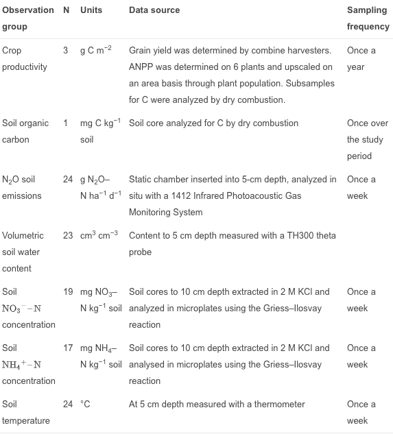

I have been looking through various published works on both DAYcent model validation and simulation of SOC using DAYcent, but it still seems like researchers either completely trust the SOC measures of DAYcent, or that SOC is known to be an output of certain inputs, such as SOC pools. The main takeaway is that repeated SOC measurements, even if it's only done each year, does not seem to be common practice.

**Necpalova, et. al (2015): Understanding the DayCent model: Calibration, sensitivity, and identifiability through inverse modeling**

https://www-sciencedirect-com.libproxy.berkeley.edu/science/article/pii/S1364815214003685#bib43

This paper is noted because it dives into how parameters affect the outputs of DAYcent. It uses inverse modeling for parameter estimation to improve model performance. I expected it to be the the closest one to describing the algorithm of DAYcent, yet it still doesn't describe how soil organic carbon is validated, it only discusses that parameters are important and calibrates these parameters using software. 

- "The DayCent model is a widely used terrestrial biogeochemical process-based model of intermediate complexity"

- "Like other biogeochemical process-based models, DayCent is typically calibrated manually by adjusting one parameter at a time... At each stage, specific processes are targeted (e.g., plant growth and yield, SOC), and the most influential parameters are adjusted to match simulated to observed values (Del Grosso et al., 2011).  
This approach, however, does not guarantee full extraction of information from the field observations and it is difficult to know when calibration correctly balances the performance of all model components (Nolan et al., 2011). It is generally accepted that manual calibration of complex ecosystem models does not necessarily yield optimal parameter estimates, is somewhat arbitrary, and results in high uncertainty in model parameters and simulated variables (Schwarz et al., 2006)."

- "SOC, crop aboveground net primary productivity (ANPP), grain yields, soil , , N2O emissions, soil temperature and volumetric soil water content (VSWC) were measured over a 3 year period (2011–2013) as part of a field experiment studying the effect of winter rye cover crop on soil N2O emissions from a corn–soybean cropping system treated with different N fertilizer rates... ...All the data, except for SOC and crop ANPP, were collected from the fertilizer bands which were, on an area basis, calculated to have received twice the N fertilizer of surrounding areas."

- "SOM is simulated in the top 20 cm soil layer as a sum of dead plant matter and three SOM pools (active, slow, and passive) on the basis of decomposition rates."

The paper includes a table of parameters and how often they are measured. Many parameters are sampled once a week, but soil organic carbon was only measured once.

**Chang, et al (2013): Using DayCENT to Simulate Carbon Dynamics in Conventional and No-Till Agriculture**

This is the paper that I had discussed earlier. Because it is about carbon dynamics, I expected it to provide a decent description of how DAYcent calculates soil organic carbon, but SOC was only simulated based on other parameters such as submodels.

Looking again at model validation:

  - 5000 year equilibrium simulation to be consistent with literature and historical events, using DayCENT
  - evaluated with linear regression and R-squared, root mean squared error, slope, intercept, compared to 2000-2007 datapoints. 
  - R^2 = 0.71 for soil water content, 0.98 for soil temperature (monitored in the field experiment with water content reflectometers - CS615, Campbell Scientific, and thermistors - 107, Campbell Scientific
  - CO2, H2O fluxes measured with 3d sonic anemometer (CSAT3 Campbell Scientific), 22% of carbon flux measurements were gap-filled with the 14 day average for that time
  - "The soil depth (0–20 cm) represented in the DayCENT model and in the different depth of soil sampling might cause the uncertainty in SOC validation and comparison."
  
  
The model validation section of this paper first describes the SOC pools and SOC levels, in which simulation suggests that they have decreased in in past centuries and ecological transition periods. The linear regressions compare simulation outputs of daily soil water content / soil temperature to the respective measured data. This still begs the question that I've been curious about - why is model validation only done on parameters and not the actual calculation of SOC?

**Bista, et al (2016): Simulating Soil Organic Carbon in a Wheat-Fallow System** 

https://dl-sciencesocieties-org.libproxy.berkeley.edu/publications/aj/abstracts/108/6/2554

This paper is specifically about soil organic carbon, so I had expected it to explain the SOC calculations from DAYcent in depth and also specifically validate the model based on SOC measurements vs. SOC DAYcent predictions. I thought I was lucky to find that this paper used archives with many years of historical data on SOC, yet realized that the SOC data itself was based on CENTURY simulations. 

- Pendleton Long-term Experiment: 100 years of management history, CENTURY model was used to simulate and predict changes in SOC from 1931 to 1986.
- model represents SOC in 3 pools: active (2-5% of total SOC), slow (45-60%), passive(45-50%), turnover times of 1-5 years, 10-50 years, 400-2000 years. Pools control carbon / nutrient flow.
- " The SOC level in the model is a function of crop C input and organic matter additions minus the loss of C from turnover (Del Grosso et al., 2011)."
