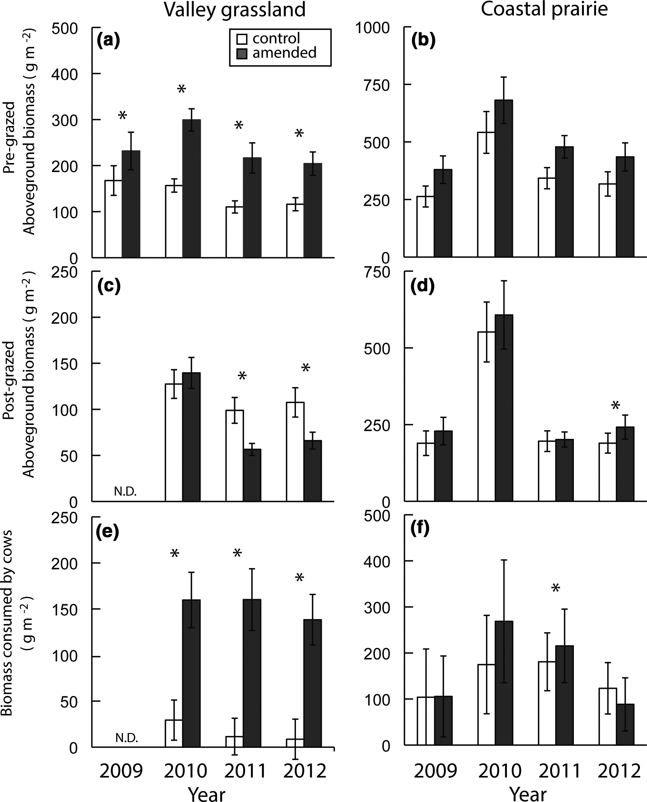
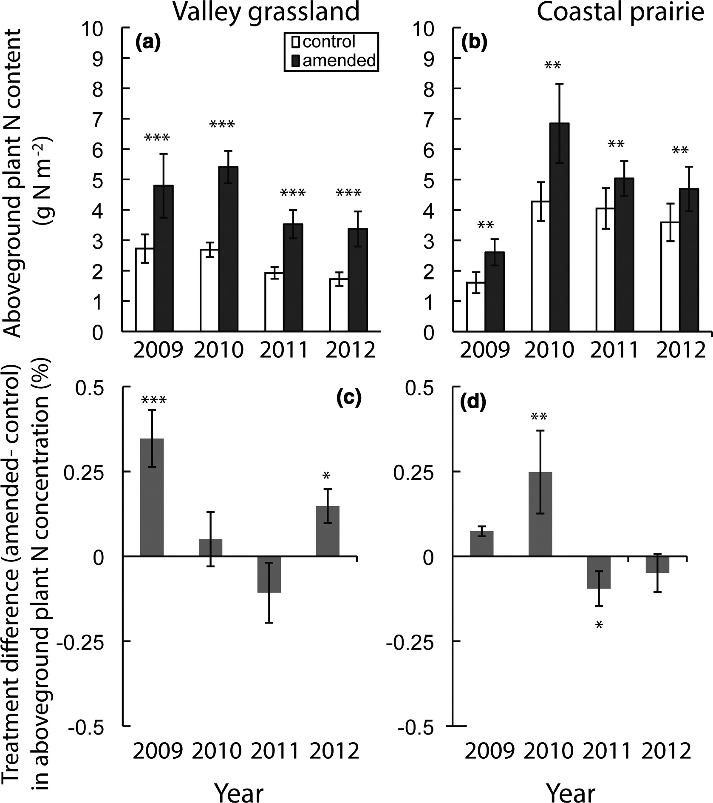
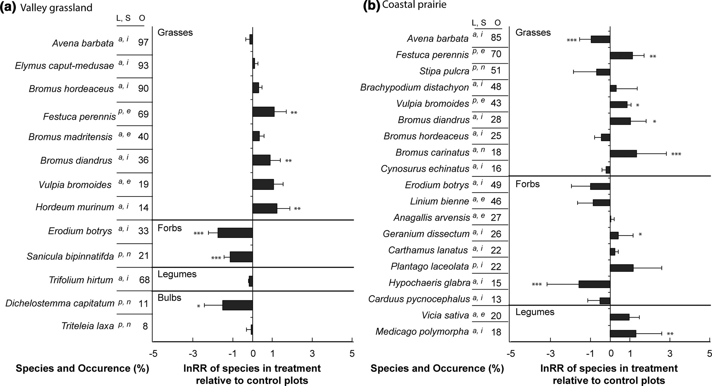

### Grassland compost amendments increase plant production without changing plant communities

_Review of article by Rebecca Ryals  Valerie T. Eviner  Claudia Stein  Katharine N. Suding  Whendee L. Silver_ 
https://esajournals.onlinelibrary.wiley.com/doi/full/10.1002/ecs2.1270

__impacts of compost amendment over 4 years on plant dynamics in two grazed grassland ecosystems in California: a coastal prairie and valley grassland__

results:
- large persistent increases in aboveground biomass 
- cobenefits to grassland plant dynamics
- "few studies have explored potential trade‐offs or cobenefits associated with management strategies that promote C sequestration"
- hypothesized that grasslands would be resistant to shifts in community composition and increases in the abundances of secondary invaders, C. lanatus and E. caput‐medusae following compost amendment

questions: 
- how do we know that this entails a meaningful difference towards atmospheric effects?
- are the treatment / control groups comparable? 
- data collection: how many acres? is this study limited just to California? what data is accessible?
- can we quantify how much carbon is being sequestered?
- __can we actually make projections?__

#### Data Exploration

- both grasslands are in northern california, rainfall had SD of ~200 mm / yr for the 4 years
- similar soil texture at both sites
- treatment / control groups in same farm. simple treatment: thin surface of compost
- measurements 24h before/after grazing
- 0.4 acre plots

### Plots

#### Fig 1

"Significant treatment differences in pregrazed aboveground biomass were detected at both grassland sites within the first year following the compost application"

"At the time of grazing, composted plots contained an average of 100 ± 16 and 128 ± 6 g·m−2·y−1 more aboveground biomass in the valley grassland and coastal prairie, respectively"

Compost was applied once - is it a significant result that there doesn't seem to be a change in ratio of pre-grazed aboveground biomass for treatment vs. control as years progress?

Clear differences in grazing behavior between valley grassland and coastal prairie. Is there a way to account for this?

#### Fig 2

"Compost amendments significantly affected plant N content. For compost treatments, plant N content of pregrazed biomass was significantly greater at both sites for all 4 yr of the study"

"The effect of compost amendments on aboveground plant N concentration was not consistent"

What do inconsistencies in treatment differences for N concentration mean? Does this detract from the value of the increased N content?

#### Fig 5: Compost treatment effect of common species

Valley grassland seems to show significant changes from compost treatment, whereas variation has heteroskedasticity in the coastal prairie. 

"We hypothesized that the grasslands in our study, which are dominated by exotic annual species, would be relatively resistant to shifts in community composition with a one‐time compost amendment... Species richness varied significantly over the 4‐yr study, but showed little effect of compost amendments. The abundance of native species did not change, and the overall species composition remained similar at each site over time." 

_This statement makes sense for the valley grassland, but is it applicable to the coastal prairie?_

### Implications of analysis

Any mention of atmospheric effects from the compost amendments come from references to other papers. At the same time, the authors say " Amending rangelands with compost is a relative new approach, and the impact of its use on grassland communities is not well known. Contrary to the general assumption from conventional practices, our data from two rangeland types suggests that a single compost addition can enhance several ecosystem services consistently through time. These results suggest that compost amendment to rangelands may provide ecosystem services, including C storage and enhanced forage production, without adversely altering plant communities."

"The lack of major shifts in vegetation or prolonged responses of noxious species suggests that there are few trade‐offs between C sequestration and plant diversity in these grasslands."

The simple experimental design of this paper provides solid evidence of how the specific grasslands responded to compost amendments, but it's not clear what kind of effect these practices have on the atmosphere. The data is not provided, so the work isn't replicable at all. 
